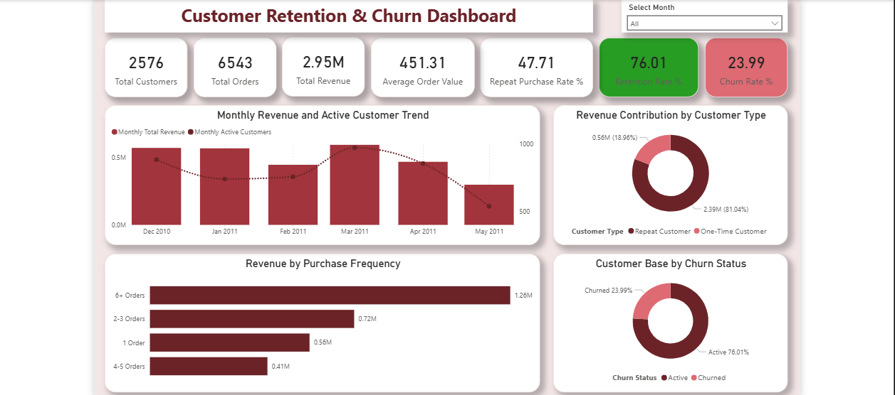

# Project 6: Customer Retention & Churn Analysis

## 📌 Project Overview
This project analyzes customer purchase behavior, retention, churn risk, and revenue contribution using transactional retail data. The goal was to identify how repeat customers impact revenue, estimate churn using customer inactivity, and build an executive-style Power BI dashboard for business decision-making.

The project combines **Excel (data cleaning)**, **MySQL (data transformation and analysis)**, and **Power BI (dashboarding and storytelling)**.

---

## 🎯 Business Objective
The objective of this project was to answer key customer analytics questions such as:

- How many customers are repeat vs one-time buyers?
- What percentage of customers are retained?
- What percentage of customers are at risk of churn?
- How much revenue comes from repeat customers vs one-time customers?
- How does customer activity and revenue trend over time?
- How does purchase frequency affect revenue contribution?

---

## 🛠️ Tools Used
- **Excel** – Data cleaning and preprocessing
- **MySQL** – SQL transformation, customer-level analysis, and churn logic
- **Power BI** – Dashboard development and visualization

---

## 🧹 Data Preparation
Before analysis, the raw transactional dataset was cleaned in **Excel** to ensure consistency and import readiness.

### Cleaning steps included:
- Removing blank or invalid customer IDs
- Ensuring `order_date` was converted to proper date format
- Standardizing numeric fields (`quantity`, `unit_price`, `sales`)
- Verifying column structure before CSV import into MySQL
- Importing the cleaned CSV into MySQL Workbench

---

## 🗃️ SQL Workflow
The SQL analysis followed a structured workflow:

1. **Imported cleaned transactional data** into MySQL
2. **Created a base table (`clean_orders`)**
3. **Aggregated line-level transactions into order-level revenue** (`order_level_orders`)
4. **Built customer-level summary metrics** (`customer_order_summary`)
5. **Classified customers as one-time or repeat buyers**
6. **Estimated churn using a 90-day inactivity rule**
7. **Created dashboard-ready SQL views** for Power BI

### Churn Logic
A customer was classified as **Churned** if the number of days between their **last order date** and the **latest order date in the dataset** was greater than **90 days**. Otherwise, the customer was classified as **Active**.

---

## 📊 Key Metrics
### Customer & Revenue Overview
- **Total Customers:** 2,576
- **Total Orders:** 6,543
- **Total Revenue:** 2.95M
- **Average Order Value:** 451.31

### Retention & Churn Metrics
- **Repeat Purchase Rate:** 47.71%
- **Retention Rate:** 76.01%
- **Churn Rate:** 23.99%

### Revenue by Customer Type
- **One-Time Customer Revenue:** 560,005.91
- **Repeat Customer Revenue:** 2,392,904.72

---

## 🔍 Key Insights

### 1. Repeat customers drive the majority of revenue
Although less than half of customers made repeat purchases (**47.71%**), repeat customers generated **2.39M** in revenue, accounting for approximately **81.04%** of total revenue.

**Insight:** Repeat customers are the primary revenue drivers and represent the most valuable customer segment.

---

### 2. One-time customers contribute significantly less revenue
One-time customers generated **560,005.91**, representing only about **18.96%** of total revenue.

**Insight:** Customers who purchase only once contribute much less long-term value, highlighting the importance of retention strategies.

---

### 3. Retention is relatively strong, but churn is still meaningful
The analysis showed a **76.01% retention rate** and a **23.99% churn rate** based on the 90-day inactivity rule.

**Insight:** While the majority of customers remain active, nearly 1 in 4 customers are at risk of churn, which suggests opportunities for re-engagement campaigns.

---

### 4. Higher purchase frequency strongly correlates with higher revenue
Customers in higher purchase frequency segments (especially **6+ Orders**) contributed the largest share of revenue.

**Insight:** Encouraging repeat purchases and increasing order frequency can significantly improve customer lifetime value.

---

### 5. Monthly activity trends reveal changing customer engagement over time
The dashboard tracks monthly revenue and active customers to help identify shifts in customer activity and business performance across the analysis period.

**Insight:** Monitoring monthly customer activity can help businesses detect slowdowns early and respond with targeted retention efforts.

---

## 📈 Dashboard Overview
The Power BI dashboard was designed as a **one-page executive summary report** focused on customer retention and churn performance.

### Dashboard includes:
- KPI cards for:
  - Total Customers
  - Total Orders
  - Total Revenue
  - Average Order Value
  - Repeat Purchase Rate
  - Retention Rate
  - Churn Rate
- Revenue Contribution by Customer Type (Donut Chart)
- Customer Base by Churn Status (Donut Chart)
- Revenue by Purchase Frequency (Bar Chart)
- Monthly Revenue and Active Customer Trend (Combo Chart)
- Date slicer for time-based filtering

---

## 🧠 Business Recommendations
Based on the findings, the following recommendations can help improve retention and customer value:

1. **Invest in retention campaigns**
   - Since repeat customers generate the majority of revenue, businesses should prioritize email remarketing, loyalty offers, and post-purchase engagement.

2. **Target one-time buyers for second purchase conversion**
   - Introduce follow-up discounts, product recommendations, or limited-time offers to convert one-time buyers into repeat customers.

3. **Build loyalty programs around high-frequency customers**
   - Customers with multiple orders are highly valuable and should be rewarded with VIP offers, exclusive deals, or personalized communication.

4. **Monitor churn proactively**
   - Use inactivity windows (such as 60–90 days) to trigger win-back campaigns before customers become fully inactive.

5. **Track monthly activity consistently**
   - Monitoring active customers and revenue trends over time can help identify seasonality, drop-offs, and opportunities for targeted interventions.

---

## 📂 Project Files
This project folder contains:

- `customer_retention_churn_analysis.sql` → Full SQL workflow for transformation, retention analysis, churn logic, and Power BI views
- `customer_retention_and_churn_dashboard.pbix` → Power BI dashboard file
- `customer_retention_churn_dashboard.png` → Dashboard preview image
- `README.md` → Project documentation

---

## 🖼️ Dashboard Preview

---

## 🚀 What This Project Demonstrates
This project demonstrates my ability to:

- Clean and prepare transactional data in Excel
- Import and structure data in MySQL
- Perform customer-level SQL analysis
- Design retention and churn logic using business rules
- Build dashboard-ready SQL views
- Create an executive-style Power BI dashboard
- Translate raw data into actionable business insights

---

## 👩🏽‍💻 Author
**Gloria Austin Ufedo**  
Data Analyst 

I enjoy turning raw data into clear insights and building dashboards that support better business decisions.

---
